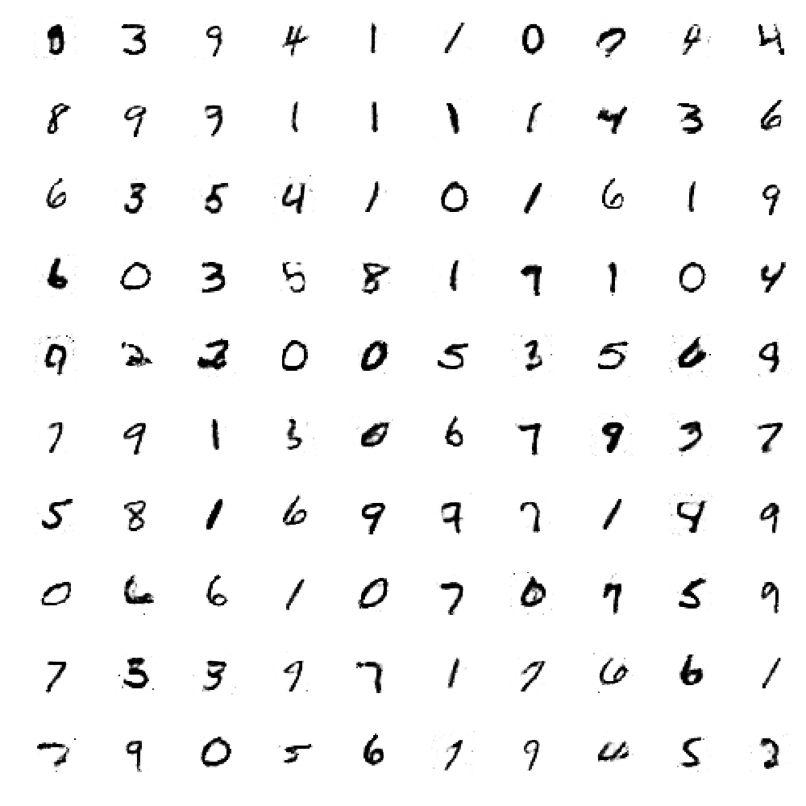

# GAN handwritten digits generation

A simple Keras implementation of a Generative Adversarial Network, used to generate images of handwritten digits. Based on the tutorial by Stefan Hosein at https://towardsdatascience.com/demystifying-generative-adversarial-networks-c076d8db8f44

## Install

After getting a working [Conda distribution](https://anaconda.org/anaconda/python), install the environment as

    conda env install -f environment.yml
    
If you do not have an nVidia GPU available, edit the environment.yml to change the `keras-gpu` package to just `keras`. 
    
Then log into the environment

    source activate mnistgan
    
## Run

Train the network with

    python mnistgan.py
